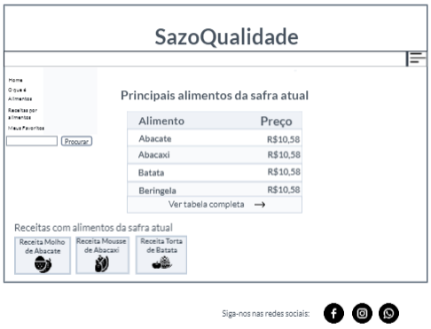

# Projeto de Interface

Pré-requisitos: <a href="2-Especificação do Projeto.md"> Documentação de Especificação</a>

Visão geral da interação do usuário pelas telas do sistema e protótipo interativo das telas com as funcionalidades que fazem parte do sistema (wireframes).

 Apresente as principais interfaces da plataforma. Discuta como ela foi elaborada de forma a atender os requisitos funcionais, não funcionais e histórias de usuário abordados nas <a href="2-Especificação do Projeto.md"> Documentação de Especificação</a>.

## User Flow

![Exemplo de UserFlow]<(img/userflow.jpg)

Fluxo de usuário (User Flow) é uma técnica que permite ao desenvolvedor mapear todo fluxo de telas do site ou app. Essa técnica funciona para alinhar os caminhos e as possíveis ações que o usuário pode fazer junto com os membros de sua equipe.

> **Links Úteis**:
> - [User Flow: O Quê É e Como Fazer?](https://medium.com/7bits/fluxo-de-usu%C3%A1rio-user-flow-o-que-%C3%A9-como-fazer-79d965872534)
> - [User Flow vs Site Maps](http://designr.com.br/sitemap-e-user-flow-quais-as-diferencas-e-quando-usar-cada-um/)
> - [Top 25 User Flow Tools & Templates for Smooth](https://www.mockplus.com/blog/post/user-flow-tools)

## Wireframes

Conforme fluxo de telas do projeto, apresentado no item anterior, as telas do sistema são apresentadas em detalhes nos itens que se seguem. As telas do sistema apresentam uma estrutura comum que é apresentada abaixo. Nesta estrutura, existem 3 grandes blocos, descritos a seguir. São eles:
Cabeçalho - local onde são dispostos elementos fixos de identidade (logo) . 
Barra superior- Apresenta navegação do site (menu com elementos de navegação secundária da aplicação e barra de pesquisa).
Conteúdo - apresenta o conteúdo da tela em questão.
 

## Tela - Home-Page

A tela de home-page mostra os principais alimentos da safra atual a partir da API utilizada pelo sistema.
Com base na estrutura padrão a barra superior traz a barra de pesquisa e um menu lateral que quando acessado contem três elementos distintos:

Componente Home que leva o usuário ao menu principal.
Componente o que é? que leva o usuário à tela com uma breve explicação sobre alimentação levando em conta a sazonalidade e seus benefícios.
Componente alimentos que leva o usuário à lista de alimentos por ordem alfabética.
Componente receitas por alimentos que dá acesso à página da lista de receitas de acordo com o alimento escolhido.
Componente meus favoritos que leva o usuário para a tela de receitas preferidas.
O bloco de Conteúdo traz a tabela de principais alimentos da safra atual (título, lista ordenada e preço) com a opção ver mais, que leva à tabela completa, além do componente receitas com alimentos da safra atual (nome da receita e foto do prato) que leva à receita do alimento.

## Tela - Receita por Alimentos

A tela de receita por alimentos apresenta, no Bloco de Conteúdo, a lista de alimentos por ordem alfabética e suas respectivas receitas. O bloco de barra superior apresenta os mesmos elementos da Home-Page. 

## Tela - Safra atual

A tela de Alimentos da safra atual, no Bloco de Conteúdo, contéma a lista de alimentos da safra atual bem como os seus respectivos preços. O bloco de barra superior apresenta os mesmos elementos da Home-Page. 

## Tela- Alimentos

A tela Alimentos  leva o usuário à lista de alimentos  por ordem alfabética.O bloco de barra superior apresenta os mesmos elementos da Home-Page. 

## Tela- Informações nutricionais

A tela Informações nutricionais apresenta informações com todos os detalhes da respectiva fruta/legumes e outras informações como manuseio e conservação.

## Tela- Meus favoritos

A tela de Meus favoritos apresenta a relação de receitas salvas pelo usuário. Ao clicar em uma receita favorita, é disparada a tela de visualização de receita. O Bloco de Barra Superior apresenta os mesmos elementos da Home-Page. 

## Tela-O que é

A tela O que é apresenta ao usuário uma breve explicação sobre alimentação levando em conta a sazonalidade e seus benefícios.

## Tela-Salvar receita favorita

A tela que permite o salvamento de notícias preferidas é uma janela modal (surge sobre outras janelas) quando o usuário pressiona o ícone coração na tela de receita do alimento. Nesta tela, a receita a ser salva é visualizada e o nome do alimento. Em seguida o usuário deve confirmar ou cancelar o salvamento. Na sequência, a tela é fechada, voltando para o ambiente anterior

## Tela - Comentários

Na tela que permite ao usuário comentar uma receita, deve-se informar o nome de quem está comentando e o texto do comentário. Esta tela é exibida na forma de uma janela modal. Em seguida, deve-se confirmar ou cancelar o salvamento do comentário. Na sequência, a tela é fechada voltando para o ambiente anterior.

## Tela - Resultado de Pesquisa

A tela Resultado de pesquisa traz a relação de informações associadas ao tópico informado. Este resultado é apresentado na Figura a seguir.

## Tela - Login

A tela Login fornece os meios para que o usuário assuma o controle de uma função, tarefa ou sistema.

